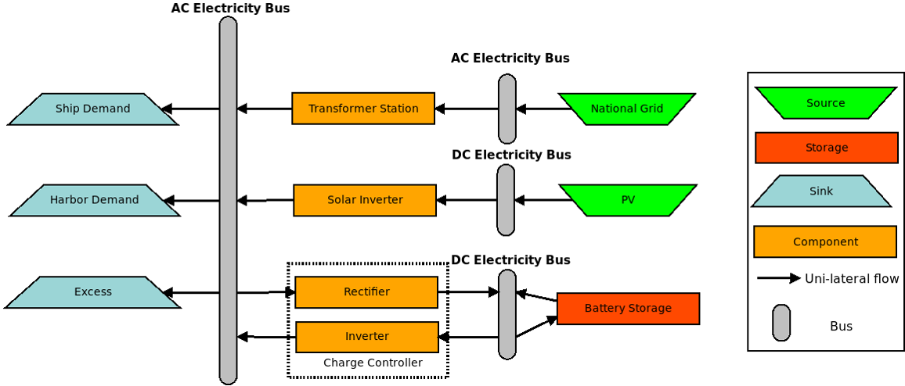

=================================================
The mathematics behind open_plan simply explained
=================================================

Aim of the open_plan tool
-------------------------

The aim of the open_plan tool is to present future scenarios for the expansion
of renewable energies in the sectors electricity and heat (and probably mobility).
[Write some more about the aim of open_plan.....]

One important aspect of future scenarios is the determination of optimal dimensioning
and combinations of various technologies. Therefore open_plan uses linear optimization.
When we think about how we want to set up our energy system, we have several
goals. For example, we want to minimize the cost of the energy system or the
amount of CO2 that we emit. Furthermore, we want to make sure that total demand
can be met at any point in time, as well as a variety of other goals.
To help us find a way to satisfy all these goals, we can use linear
optimization. What was briefly outlined in the last section is basically a
non-mathematical way of describing the main and secondary conditions that we
need to use linear optimization. In the following example, this will be further illustrated.

[Das folgende ist ein einfaches Beispiel, was die Methodik der linearen Optimierung anhand
eines zweidimensionalen Lösungsraums erklären soll.]

An energy system with various technologies
------------------------------------------

When it comes to electricity generation, we can imagine a simple energy system using solar energy and fossil fuels.
To use solar energy we need PV tiles, and to use the fossil fuel, we need a fossil
fuel power station. For both technologies, we are trying to find out how much
capacity we should build to get the cost minimum solution.
We also have a battery, and we have the end user, who consumes energy.
..
    We also try to find out, if installing a battery would be an option to
    further reduce costs. Further our energy system contains the electricity consumption.

[Picture Energysystem]

Using this data, we can now think about our optimal solution. In this case our
objective is to minimize costs. The objective function is described as a linear
function that we want to minimize.
[spez. Kosten + repective installed capacities]

We can now represent this graphically as a solution space, which shows us all the possible input combinations.
On the x-axis we have the fossil fuel generator capacity, and on the y-axis we have the
PV cells generation capacity. Any point within the solution space is a possible
solution, and using linear optimization, we will find the optimum.

.. image:: images/slide_1.pdf
 :width: 200

If we just want to minimize the costs, we would have to say that the optimum is
(0,0), as this costs us the least. Therefore, we need to add more information,
or more secondary conditions.
An optimization is linear as long as the main and secondary conditions only
contain linear functions. In the following section, we will look at a few
secondary conditons.

In our example, we assume that a small fossil fuel generator has already been
installed, and consequently, the solution space is reduced, as shown in the
graphic.

.. image:: images/slide_2.pdf
 :width: 200

Another secondary condition is that the amount of solar capacity that we can
build is restricted by the area that we can actually build solar cells on,
which is represented by the purple line.

(Slide 3)
.. image:: images/slide_2.pdf
 :width: 200

We also know that we do not want to install more capacity than necessary,
meaning that the generation capacity of the fossil fuel generator should not
exceed the peak demand, which is shown by the black straight line. 

Slide 4
.. image:: images/slide_2.pdf
 :width: 200

We also have to be able to meet the peak demand. We need to make sure that we
have enough capacity installed to meet this demand, which is depicted by the
diagonal line, which shows us all the combinations of solar and fossil fuel
capacity that let us meet peak demand. However, all the solutions above the
diagonal line are also theoretically possible.

Slide 4
.. image:: images/slide_2.pdf
 :width: 200

We also have some PV cells installed, and consequently, our solution space is
reduced again. 

Slide 5
.. image:: images/slide_2.pdf
 :width: 200

Finally, we also want to make sure that our energy system is sustainable, and
therefore, we define a maximum amount of CO2 that we want to emit, which is
represented by the green line. After having reduced the solution space again,
we now turn to solving the optimization problem

Slide 6
.. image:: images/slide_2.pdf
 :width: 200

After we have defined our solution space, the next step is to find the optimum.
Several ways of solving these problems have been developed, one of which is the
simplex method. This can be done on paper, but as the number of equations
rises, this becomes more and more difficult.

In open_plan this is done by a solver, which can solve the optimization, given
that the equations are in a certain form. The solver then proceeds in two
steps. In the first step, it checks if there is a solution to the problem, and
as soon as a solution is found, the solver proceeds to the second step. In the
second step, the solver then tries to find a better solution, and continues
this process iteratively, until it has found the best solution. To do this,
the solver moves along the edges of the solutions space, as the optimum will
always lie on the edge of the solution space in a linear optimization model,
as long as there is an optimum.
In our simple example, this means that the solution has to lie somewhere on
the edge of our solutions space. In this case the solution is the yellow
point.

Slide 7
.. image:: images/slide_2.pdf
 :width: 200

It is also possible that several solutions exist. Graphically, this would mean
that an entire edge of the constraint to the solution space would be an
optimum, meaning that we have several solutions that give us the same, optimal
result. In this case we can pick any point of the input combinations that lead
us to the optimal solution.
If we increase the complexity, by either adding more secondary conditions, or
by expanding the main condition, the solution space becomes more complex, and
can go from 3 Dimensional to 50 Dimensional or even more. When the solution
space becomes more complex, it becomes basically impossible to graphically
demonstrate how the solution space is solved, but the principle is exactly the
same in a two dimensional problem or a 50 Dimensional problem, it just takes
longer for the solver to do its work.

- Presentation of the benefits of individual technologies

Solving energy management problems with the help of linear optimization

General information on modeling

Reduction of the considered system to subcomponents with a certain level of detail

real system
Simplifications are necessary
Results can be complex

Energy systems based on renewable energies can become very complex.

The components with which an energy supply system can be modeled in open_plan are classified as follows:

- Sources
- Sinks
- Transformer
- Storage

.. TODO: link to oemof-solph

Sub header 1
############

text

Sub header 2
############

text

Header 2
--------
