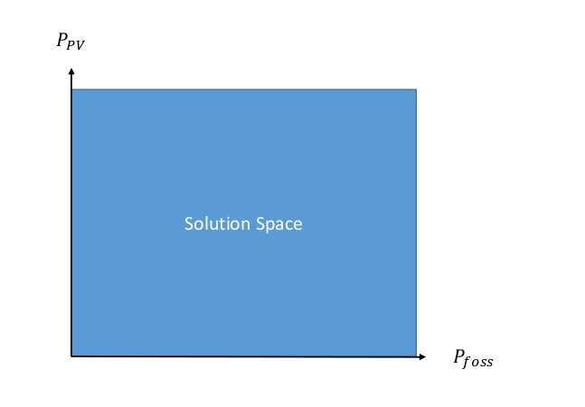
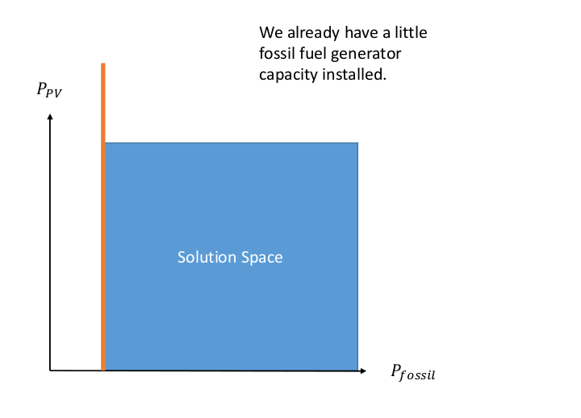

=================================================
The mathematics behind open_plan simply explained
=================================================

Aim of the open_plan tool
-------------------------

The aim of the open_plan tool is to present future scenarios for the expansion
of renewable energies in the sectors electricity and heat (and probably mobility).
[Write some more about the aim of open_plan.....]

One important aspect of future scenarios is the determination of optimal dimensioning
and combinations of various technologies. Therefore open_plan uses linear optimization.
When we think about how we want to set up our energy system, we have several
goals. For example, we want to minimize the cost of the energy system or the
amount of CO2 that we emit. Furthermore, we want to make sure that total demand
can be met at any point in time, as well as a variety of other goals.
To help us find a way to satisfy all these goals, we can use linear
optimization. What was briefly outlined in the last section is basically a
non-mathematical way of describing the main and secondary conditions that we
need to use linear optimization. In the following example, this will be further illustrated.

[Das folgende ist ein einfaches Beispiel, was die Methodik der linearen Optimierung anhand
eines zweidimensionalen Lösungsraums erklären soll.]

An energy system with various technologies
------------------------------------------

When it comes to electricity generation, we can imagine a simple energy system using solar energy and fossil fuels.
To use solar energy we need PV tiles, and to use the fossil fuel, we need a fossil
fuel power station. For both technologies, we are trying to find out how much
capacity we should build to get the cost minimum solution.
We also have a battery, and we have the end user, who consumes energy.
..
    We also try to find out, if installing a battery would be an option to
    further reduce costs. Further our energy system contains the electricity consumption.

[Picture Energysystem]

Using this data, we can now think about our optimal solution. In this case our
objective is to minimize costs. The objective function is described as a linear
function that we want to minimize.
[spez. Kosten + repective installed capacities]

We can now represent this graphically as a solution space, which shows us all the possible input combinations.
On the x-axis we have the fossil fuel generator capacity, and on the y-axis we have the
PV cells generation capacity. Any point within the solution space is a possible
solution, and using linear optimization, we will find the optimum.

If we just want to minimize the costs, we would have to say that the optimum is
(0,0), as this costs us the least. Therefore, we need to add more information,
or more secondary conditions.
An optimization is linear as long as the main and secondary conditions only
contain linear functions. In the following section, we will look at a few
secondary conditons.

In our example, we assume that a small fossil fuel generator has already been
installed, and consequently, the solution space is reduced, as shown in the
graphic.

- Presentation of the benefits of individual technologies

Solving energy management problems with the help of linear optimization

General information on modeling

Reduction of the considered system to subcomponents with a certain level of detail

real system
Simplifications are necessary
Results can be complex

Energy systems based on renewable energies can become very complex.

The components with which an energy supply system can be modeled in open_plan are classified as follows:

- Sources
- Sinks
- Transformer
- Storage

.. TODO: link to oemof-solph

.. image:: images/energy_system_model.png
 :width: 200

Sub header 1
############

text

Sub header 2
############

text

Header 2
--------
